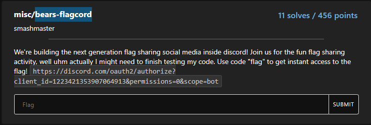
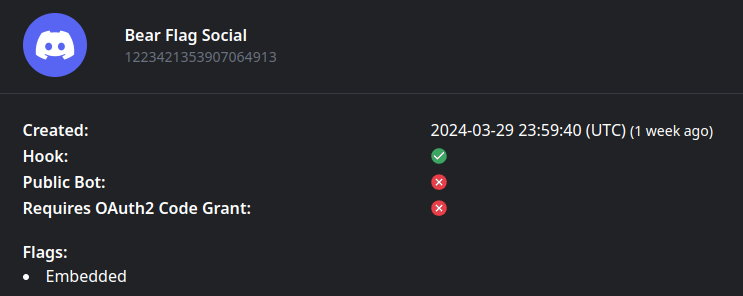
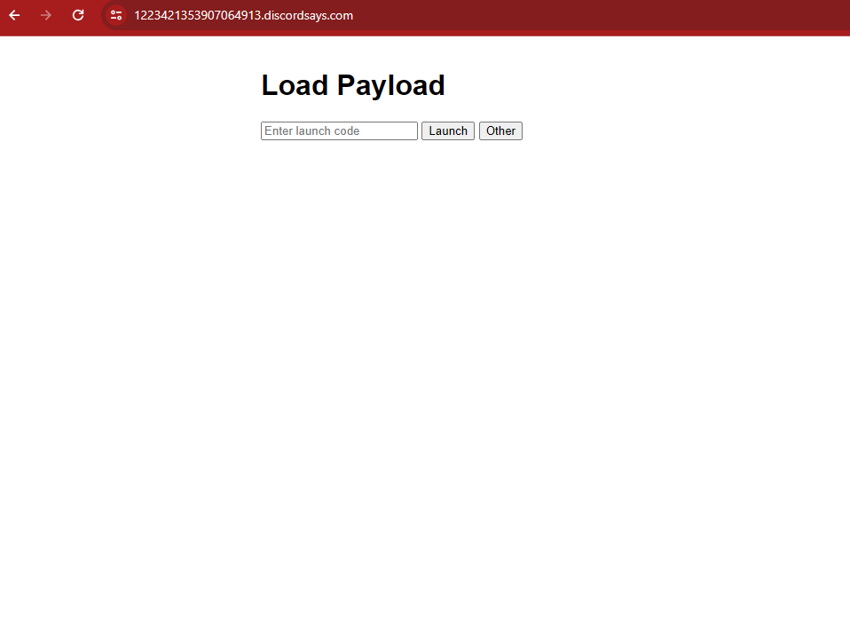

# Misc-Bears-flagcord

(almost) solved by makider https://makider.me/

## Challenge Text

We're building the next generation flag sharing social media inside discord! Join us for the fun flag sharing activity, well uhm actually I might need to finish testing my code. Use code "flag" to get instant access to the flag! https://discord.com/oauth2/authorize?client_id=1223421353907064913&permissions=0&scope=bot



## writeup

this challenge was very fun and up to date imo. i loved it.

to solve it me and my teammate yyxxzn analyzed the link first of all.

https://discord.com/oauth2/authorize?client_id=1223421353907064913&permissions=0&scope=bot

if you try to use it and add to a server it will say that its a private bot or application and cant be added to your server. 

So we tried to modify the scope and the permissions, without success by following the api docs of discord

https://discord.com/developers/docs/topics/oauth2

nothing really worked, so we tried to investigate what this id was all about.

we used a online tool called discordlookup

https://discordlookup.com/application/1223421353907064913

but we could have also used the public discord api.



we can see here that the id appears to represent a `embedded` application. 

discord embedded applications are activities that you can start when you join a discord channel and click the rocket icon

https://discord.com/developers/docs/activities/building-an-activity

basically we had to find a way to open this activity thus bypassing the filter.

To do this, i intercepted discord request to find out how discord chooses what discord activity to start.

Unfortunately, i tried to modify the request without success for about 30 minutes before giving up, but i was really close because literally the request after the one i was trying to modify was the solution.

infact after the ctf i tried digging deeper and found this request here

```
GET / HTTP/2
Host: 832012774040141894.discordsays.com
Sec-Ch-Ua: "Google Chrome";v="123", "Not:A-Brand";v="8", "Chromium";v="123"
Sec-Ch-Ua-Mobile: ?0
Sec-Ch-Ua-Platform: "Windows"
Upgrade-Insecure-Requests: 1
User-Agent: 1
Accept: text/html,application/xhtml+xml,application/xml;q=0.9,image/avif,image/webp,image/apng,*/*;q=0.8,application/signed-exchange;v=b3;q=0.7
Sec-Fetch-Site: cross-site
Sec-Fetch-Mode: navigate
Sec-Fetch-User: ?1
Sec-Fetch-Dest: iframe
Referer: https://discord.com/
Accept-Encoding: gzip, deflate, br
Accept-Language: it-IT,it;q=0.9,en-US;q=0.8,en;q=0.7
```

while opening the chess in the park activity on discord

to get the flag we can simply modify the request with the id of our target application

from

https://832012774040141894.discordsays.com/

to

https://1223421353907064913.discordsays.com/



to get the flag we can now just write "flag" as the launch code, thus bypassing the filter and getting the flag!

what a cool challenge!

### The flag

`amateursCTF{p0v_ac3ss_c0ntr0l_bypass_afd6e94d}`
