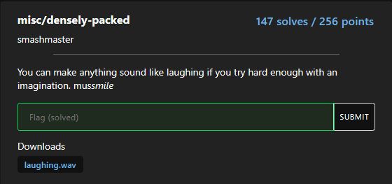

# Misc-Densely-packed

solved by makider https://makider.me/

## Challenge Text

You can make anything sound like laughing if you try hard enough with an imagination. mussmile

## writeup

this was a audio forensics challenge.

at first i tried to plug it in a spectrogram analyzer, but nothing really stands out.

after a bit i tried to search on the internet about the hint `mussmile`   

mussmile is a sound of the famous game undertale.

https://www.youtube.com/watch?v=9D1ztZgQYdE&pp=ygUIbXVzc21pbGU%3D

why it's a hint? because this sound is made by distorting and slowing down a laughing sound.

so after researching a bit i used this online-based audacity editor here https://wavacity.com/ to slow the sound down by 90%. After that you can just hear it's reversed.

So now we can reverse it and simply hear the flag being said by a AI voice.

done!

### The flag

`amateursCTF{inverse_transformations}`
