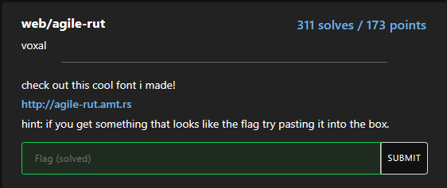

# Web-Agile-Rut

solved by makider https://makider.me/

## Challenge Text

check out this cool font i made!
http://agile-rut.amt.rs
hint: if you get something that looks like the flag try pasting it into the box.



## writeup

this challenge was conceptually very simple but as i've never worked with font files, it wasn't immediate for me.

to solve this challenge we have to analyze the requests via burpsuite proxy

let's first of all get the page source code:

```html
<!DOCTYPE html>
<html lang="en">

<head>
    <meta charset="UTF-8">
    <meta name="viewport" content="width=device-width, initial-scale=1.0">
    <title>agile rut playground</title>
    <style>
        @font-face {
            font-family: 'Agile Rut';
            src: url('agile-rut.otf');
        }
        * {
            font-family: 'Agile Rut';
        }
        textarea {
            font-size: 24px;
        }
    </style>
</head>

<body>
    <h1>Agile Rut</h1>
    <p>Check out my new font!! isn't it so cool!</p>
    <textarea cols="100" rows="100"></textarea>
</body>

</html>
```

this is just a html page to try a font, but apparently our flag could be hidden in the otf file.

upon further investigation i found out that you can hide custom chars in the font file as glyphs

to solve it i first tried to use python fonttools 

```bash
pip install fonttools
ttx agile-rut.otf
```

and dumped information about the font, but as it was a very long file i tried to use a web tool

unfortunately i don't remember exactly the name but i think this should do too

https://fontdrop.info/#/?darkmode=true

if we go the custom ligatures you should see the flag in one of them.

You could also solve it with the ttx tool as i did before. At some point you will find this ligature here:

`<Ligature components="m,a,t,e,u,r,s,c,t,f,braceleft,zero,k,underscore,b,u,t,underscore,one,underscore,d,o,n,t,underscore,l,i,k,e,underscore,t,h,e,underscore,j,b,m,o,n,zero,underscore,equal,equal,equal,braceright" glyph="lig.j.u.s.t.a.n.a.m.e.o.k.xxxxxxxxx.xxxx.x.xxxxxxxxxx.x.x.x.xxxxxxxxxx.xxx.xxxxxxxxxx.x.x.x.x.xxxxxxxxxx.x.x.x.x.xxxxxxxxxx.x.x.x.xxxxxxxxxx.x.x.x.x.x.xxxx.xxxxxxxxxx.xxxxx.xxxxx.xxxxx.xxxxxxxxxx"/>
`

that clearly resembles the flag.

i guess i am a bit blind lol :D

### The flag

`amateursctf{0k_but_1_dont_like_the_jbmon0_===}`
